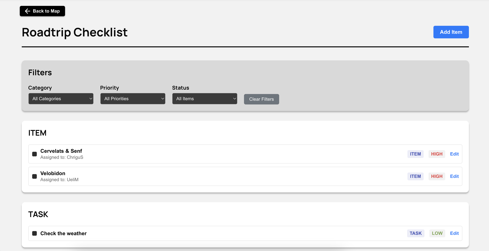
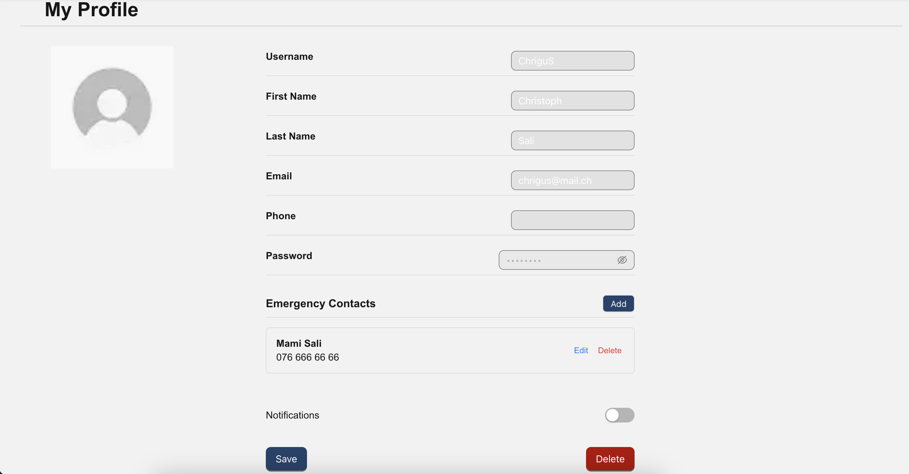

# Mapmates: Your Road Trip Companion


 

## User Flow and Application Overview

Mapmates is an interactive road trip planning and management application designed to make your travel experiences seamless and enjoyable. Here's a walkthrough of the main user journey:

### 1. Dashboard - My Roadtrips
After authentication, users land on the My Roadtrips page where they can:
- Create a new road trip
- View existing road trips
- Access trip details


### 2. Road Trip Planning
When creating or editing a road trip, users can:
- Set trip details (name, dates, etc.)
- Plan routes using an interactive map
- Add Points of Interest (POIs)
- Create and manage checklists
- Invite other members to the trip

 

### 3. Collaborative Features
- Invite team members to join your road trip
- Collaborate on route planning
- Share and update checklists
- Manage trip settings

 

### 4. Profile Page
- Enter and modify user details
- add and modify emergency contacts

 

# Local Development

## Prerequisites
- Node.js (version 18 or later)
- npm or Deno

## Setup and Installation

1. Clone the repository
```bash
git clone https://github.com/YOUR_USERNAME/mapmates-client.git
cd mapmates-client
```

2. Install dependencies
```bash
npm install
```

## Running the Application

### Development Mode
To start the development server:
```bash
npm run dev
```
The application will be available at `http://localhost:3000`

### Production Build
To create and run a production build:
```bash
npm run build
npm run start
```

## Available Scripts

- `npm run dev`: Start development server
- `npm run build`: Create production build
- `npm run start`: Run production build
- `npm run lint`: Run code linter
- `npm run format`: Format code using configured style guidelines

## Environment Configuration

Create a `.env.local` file in the project root for environment-specific variables. Refer to `.env.example` for required environment variables.

## Troubleshooting

- Ensure you have the correct Node.js version installed
- Verify all dependencies are installed correctly
- Check your environment variables
- If encountering issues, try clearing npm cache: `npm cache clean --force`

## Contributing

Please read the contributing guidelines before making pull requests.
